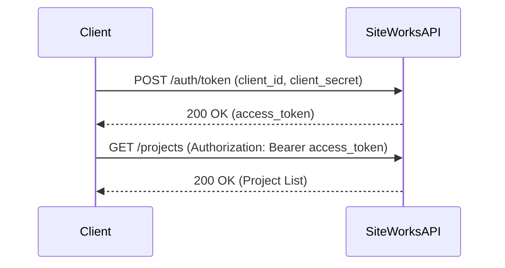
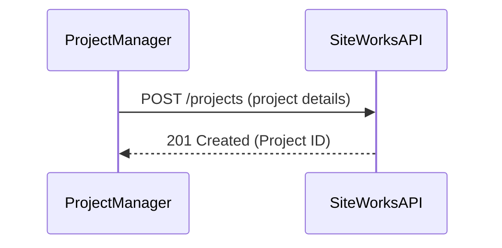
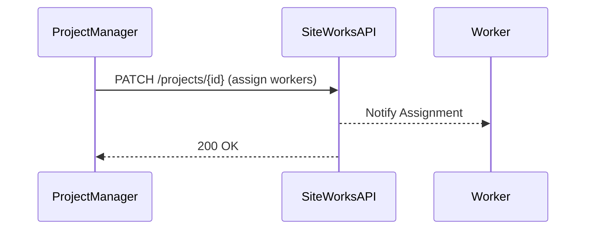
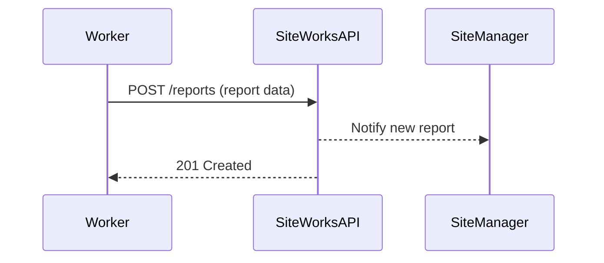
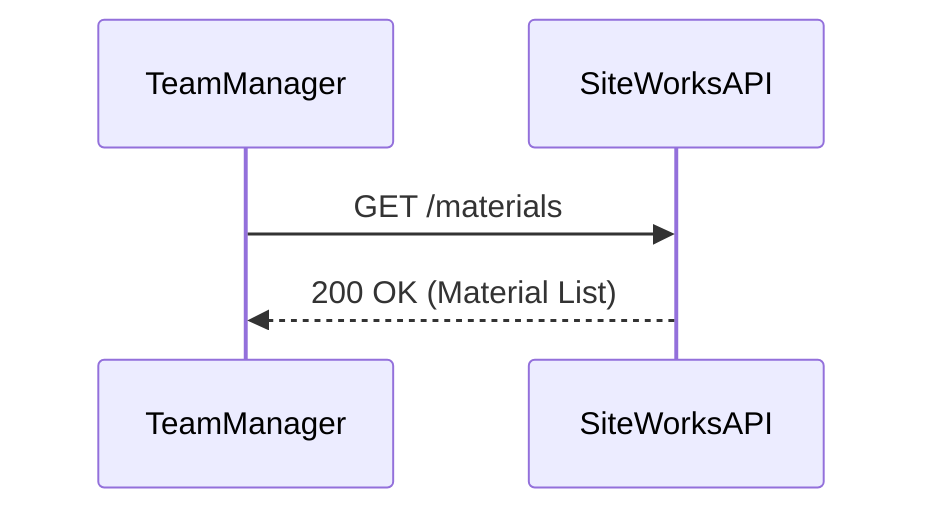

# API Sequence Diagrams

## 1️. Authentication Flow

The authentication process follows OAuth 2.0 with JWT to ensure secure access.

## 2️. Creating a New Project

A **Project Manager** creates a new project, and the API validates and stores it.

## 3️. Assigning Workers to a Project

A **Project Manager** assigns workers to a construction project.

## 4️. Worker Submitting a Report

A **Worker** submits a daily progress report, and the **Site Manager** reviews it.

## 5️. Fetching Material Inventory

A **Team Manager** requests the current material stock.

For more details, refer to the [API Authentication Guide](api-authentication.md) and [API Endpoints](api-endpoints.md).
