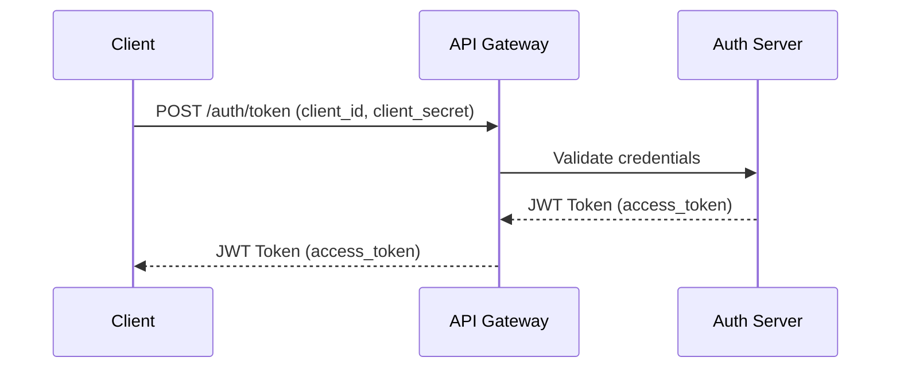
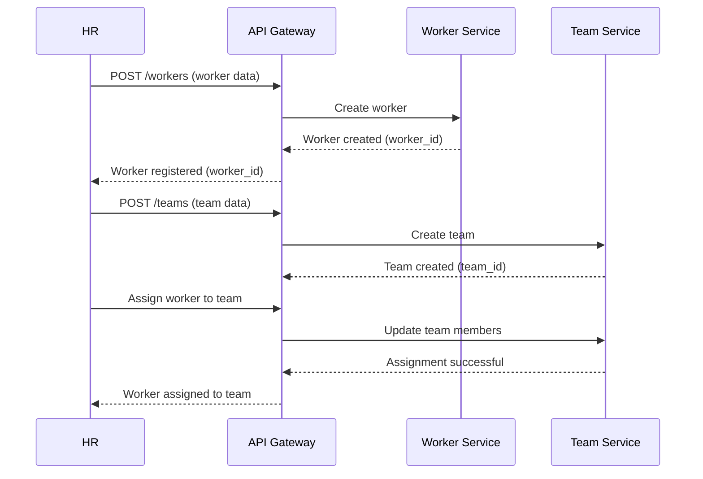
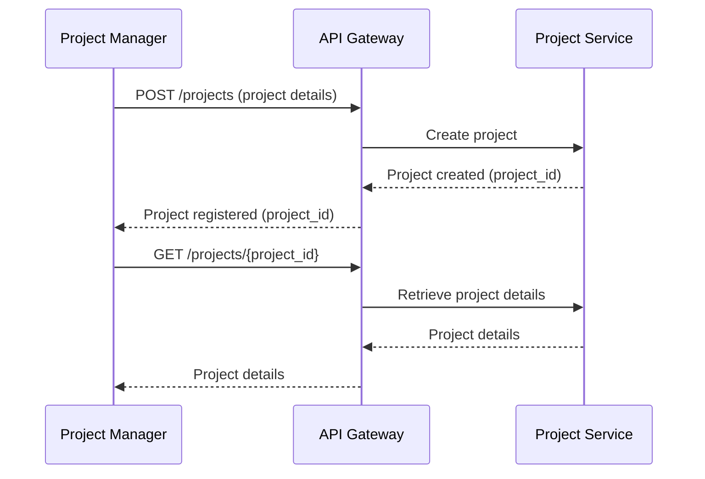
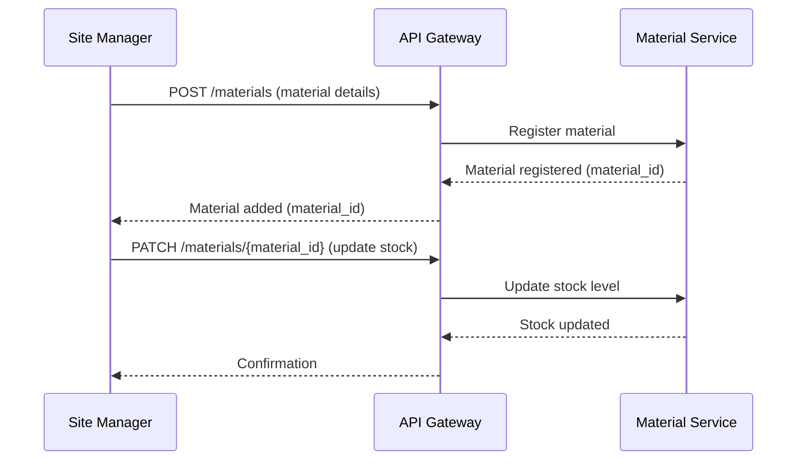
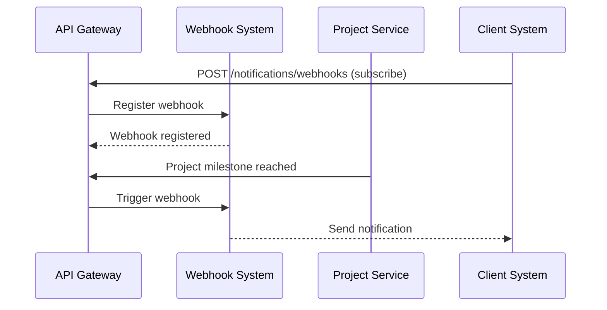

# SiteWorks API - Sequence Diagrams

## 1. Authentication & Security

### Sequence Diagram - Obtaining a JWT Token

## 2. Worker & Team Management

### Sequence Diagram - Registering and Assigning a Worker

## 3. Project Management

### Sequence Diagram - Creating and Tracking a Project

## 4. Material & Supply Chain Management

### Sequence Diagram - Tracking Material Stock Levels

## 5. Notifications & Webhooks

### Sequence Diagram - Receiving Real-Time Project Updates

