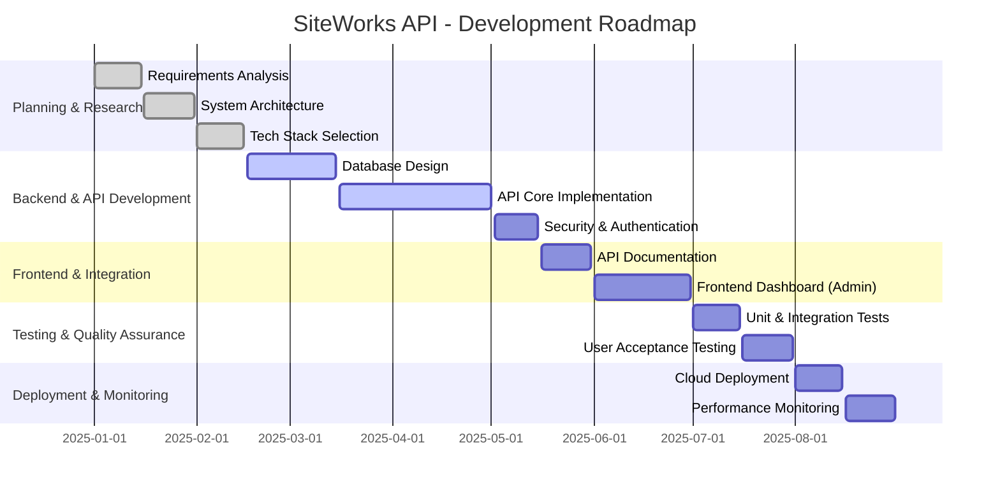

# SiteWorks API - Product Roadmap

## Overview

This document provides a high-level roadmap for the development of **SiteWorks API**. The roadmap follows an **Agile methodology** with iterative development, testing, and deployment.

The estimated total duration for the project is **9 months**, divided into key phases:

1. **Planning & Research (1.5 months)**
2. **Backend & API Development (3 months)**
3. **Frontend & Integration (2 months)**
4. **Testing & Quality Assurance (1.5 months)**
5. **Deployment & Monitoring (1 month)**

## Project Timeline - Gantt Chart

The following **Gantt chart** visualizes the project timeline:

## Phase Breakdown

### 1. Planning & Research (1.5 months)

- Define system requirements and scope.
- Identify stakeholders and API consumers.
- Choose a **robust tech stack**.
- Design the API architecture & database schema.

### 2. Backend & API Development (3 months)

- Build **database models and API endpoints**.
- Implement **JWT & OAuth 2.0 authentication**.
- Secure API access with **role-based access control (RBAC)**.
- Develop core modules: workers, teams, projects, materials, subcontractors, clients, etc.

### 3. Frontend & Integration (2 months)

- Develop **API documentation** (Swagger, MkDocs).
- Build a dashboard for API consumers.
- Ensure API endpoints integrate well with frontend applications.

### 4. Testing & Quality Assurance (1.5 months)

- Write unit tests(JUnit).
- Perform integration tests (Postman, Jest).
- Conduct User Acceptance Testing.

### 5. Deployment & Monitoring (1 month)

- Deploy the API to cloud environments.
- Set up monitoring & logging.
- Optimize API performance and prepare for public release.

---

## Future Enhancements

- **Mobile SDKs** for third-party developers.
- **IoT Integration** for connecting sensors to monitor equipment and worker safty.
- **AI-powered analytics** for project tracking.
- **Multi-language support** for global users.

_This roadmap is subject to adjustments based on project progress and feedback._
